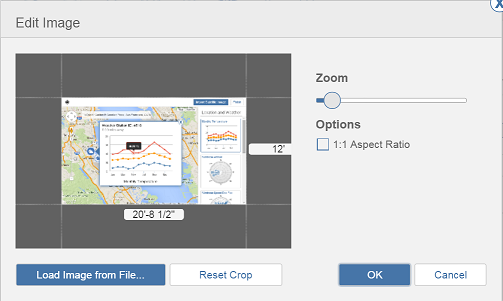

# Importieren und Ändern von Geländeüberlagerungsbildern

---

Erfassen Sie Bilder für den Arbeitsbereich Ihres Entwurfs und ändern Sie sie nötigenfalls.

## Importieren von Geländeüberlagerungsbildern

1. Wählen Sie die Schaltfläche Importieren im Werkzeugkasten, um ein Bild zu importieren.

1. Wählen Sie ein Bild aus Ihrem lokalen Dateisystem oder Ihrem A360-Drive.
2. Bearbeiten Sie das Bild, falls erforderlich.

3. Klicken Sie auf OK, um das Bild hinzuzufügen.
## Ändern von Geländeüberlagerungsbildern

1. Verwenden Sie die Palette an der rechten Seite des Bildschirms, um Bildeigenschaften zu ändern.
2. In der Palette können Sie den Namen und die Transparenz des Bilds bearbeiten.
3. Durch Ziehen und Ablegen im Bereich Vertikale Anordnung können Sie die Positionierung (Reihenfolge) aller Geländeüberlagerungsbilder einschließlich importierter Satellitenbilder (sofern vorhanden) festlegen.

