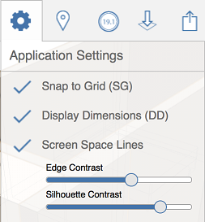

# Anwendungseinstellungen

---

Mit Anwendungseinstellungen bestimmen Sie die Darstellung und das Verhalten der gesamten FormIt 360-App.

### Anwendungseinstellungen

| | |
| ---- | ---- |
|  |  * *Rasterfang*: Mit dieser Funktion aktivieren oder deaktivieren Sie den Rasterfang.** * *Bemaßungen anzeigen*: Zeigt numerische Werte für die Länge, Breite usw eines Objekts an. ** * *Bildschirmlinien:* Aktivieren Sie diese Funktion, um die grafische Darstellung komplexer Modelle zu verbessern. Sie können den Kontrast sowohl von Silhouettenkanten als auch normaler Kanten steuern. ** * *Kantenkontrast:* Verstärken oder reduzieren Sie den Kontrast bei der Anzeige von Kanten.    **    *Silhouettenkontrast:* Verstärken oder reduzieren Sie den Kontrast bei der Anzeige von Silhouettenkanten.  |

