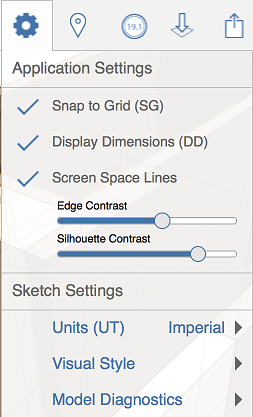

# Anwendungs- und Skizzeneinstellungen

---

Mit anwendungsweiten und skizzenspezifischen Einstellungen steuern Sie die Darstellung und das Verhalten der Anwendung und einzelner Skizzen.

* Mit Anwendungseinstellungen bestimmen Sie die Darstellung und das Verhalten der gesamten FormIt 360-App.
* Mithilfe spezieller Einstellungen für Skizzen können Sie die Darstellung und das Verhalten der aktuell geöffneten Skizze ändern.

* 

#### Themen in diesem Abschnitt

* [Skizzeneinstellungen](../Sketch Settings.md)

Mithilfe spezieller Einstellungen für Skizzen können Sie die Darstellung und das Verhalten der aktuellen Skizze ändern.

* [Anwendungseinstellungen](../Application Settings.md)

Mit Anwendungseinstellungen bestimmen Sie die Darstellung und das Verhalten der gesamten FormIt 360-App.

