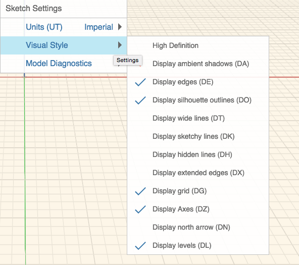
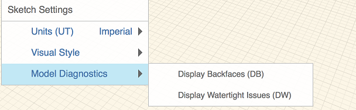

# Skizzeneinstellungen

---

Mithilfe spezieller Einstellungen für Skizzen können Sie die Darstellung und das Verhalten der aktuellen Skizze ändern.

### Skizzeneinstellungen

| | |
| ---- | ---- |
|  |  *Einheiten*: Ändern der Einheiten in britische (Fuß und Zoll) oder metrische  *Bildstil*  * *High Definition*: Ermöglicht eine verbesserte Darstellung von Grafik auf Displays mit hoher Pixeldichte. Diese Einstellung kann Leistungseinbußen verursachen. * *Display ambient shadows*: Aktivieren Sie diese Funktion, um dem Modell weiche Schatten hinzuzufügen. * *Display edges*: Durch Aktivieren bzw. Deaktivieren dieser Funktion blenden Sie Kanten im Modell ein bzw. aus. Diese Option lässt sich für Präsentationen gut zusammen mit Umgebungsschatten einsetzen. * *Display silhouette outlines*: Betont Formen durch Zeichnen einer etwas stärkeren Umrisslinie für Silhouetten. * *Display wide lines*: Die breitestmöglichen Linien. * *Display sketchy lines*: Ändern Sie die Darstellung Ihrer Skizze durch Aktivieren oder Deaktivieren einer Liniendarstellung, die wie von Hand gezeichnet wirkt. * *Show hidden lines*: Zeigt schwache Linien an Stellen an, die normalerweise durch andere Flächen verdeckt sind. * *Display extended edges*: Zeigt an Schnittpunkten von Linien kurze Verlängerungen an. * *Display grid*: Blendet das Raster ein oder aus. * *Display axes: *Blendet die Achsen des Koordinatensystems ein oder aus. * *Display north arrow: *Blendet den Nordpfeil ein oder aus. * *Display levels*: Blendet die Ebenen ein oder aus.   |
|  |  *Modelldiagnose*  * *Display Backfaces: *Flächen, die an der Außenseite liegen, obwohl dies nicht der Fall sein dürfte, werden violett angezeigt. * *Display Watertight Issues*: Löcher in Flächen und Linien/Kanten, die nicht mit einem Objekt verbunden sind, werden violett angezeigt.  |

