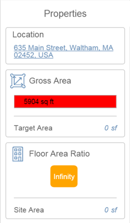

# Gebäudenutzbarkeit

---

Starten Sie BIM-Arbeitsabläufe, indem Sie im Entwurfsprozess von Anfang an die Effizienz von Elementen beurteilen.

### Gebäudenutzbarkeit

| | |
| ---- | ---- |
| In der Eigenschaftenpalette können Sie Gebäudeattribute wie die Fläche überprüfen. |  |

#### Siehe auch

* [Objekteigenschaften anzeigen ](../../Modify Designs/Examine Object Properties.md)
* [Volumen- und Raumnutzung](../../Levels and Space Usage/README.md)

#### Themen in diesem Abschnitt

* [ Sonnen- und Schatteneinstellungen ](../Sun and Shadow Settings.md)

Steuern Sie die Winkel der Schatten an Ihren Standorten mithilfe von Datum und Uhrzeit.

* [Sonnenstudie](../Solar Analysis.md)

Visualisierung der Sonneneinstrahlung auf Ihr Modell.

* [Energieanalyse des gesamten Gebäudes](../Whole Building Energy Analysis.md)

Sie können Faktoren auswerten, die sich auf die Gebäudeeffizienz auswirken, z. B. Wanddämmung und Effizienz der Lüftung.

