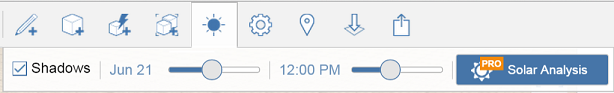
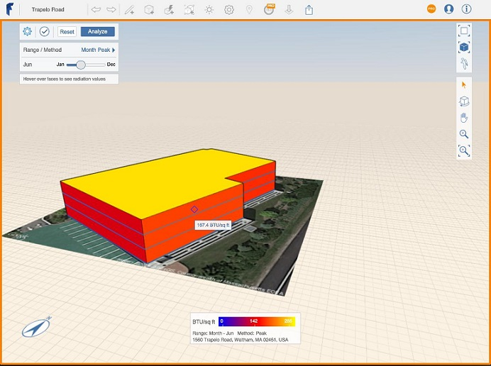

# Sonnenstudie

---

Visualisierung der Sonneneinstrahlung auf Ihr Modell.

Nur Autodesk FormIt 360 Pro

1. Klicken Sie auf das Symbol Sonne und Schatten.

2. Wählen Sie ein Objekt oder eine Fläche aus.

3. Klicken Sie auf Berechnen.

4. Das Diagramm für die Sonnenstudie wird angezeigt.

5. Klicken Sie auf das Symbol , um zwischen den Optionen Monatsspitze und Jahr kumulativ umzuschalten.

Dabei wechseln Sie mit Monatsspitze zum Spitzenwert der Sonneneinstrahlung in BTU/ft² bzw. Wh/m² für jeden Monat und mit Jahr kumulativ zur Gesamtsonneneinstrahlung in kW/m². Die Option Monatsspitze ist hilfreich bei der Entwicklung einer Schattierungsstrategie für die Fassade des Gebäudes. Jahr kumulativ ist nützlich für die Bestimmung des Potenzials für photovoltaische Zellen.

6. Mithilfe des Schiebereglers können Sie unterschiedliche Jahreszeiten einstellen.
7. Klicken Sie zum Beenden auf .

