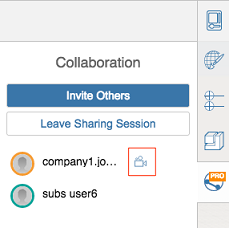

# Einer Sitzungskamera folgen

---

Betrachten Sie die Arbeiten aus der Perspektive eines anderen Teammitglieds.

Es kann nützlich sein, die Arbeit eines anderen Benutzers über dessen Kamera aus seiner Perspektive zu betrachten.

* Klicken Sie neben dem Namen des Benutzers, dem Sie folgen möchten, auf Kamera folgen.

Eine rote Markierung wird angezeigt, über die Sie die Beobachtung beenden können.

