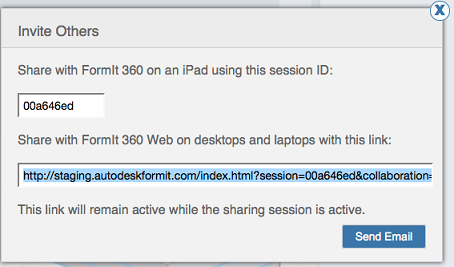

# Einladen anderer Benutzer zu einer Sitzung

---

Erstellen Sie ein Team für die Zusammenarbeit.

## Einladen anderer Benutzer zu einer Sitzung

* Klicken Sie im Dropdown-Menü im Werkzeugkasten auf die Option Andere Personen einladen.

Ein Dialogfeld mit einer Sitzungs-ID für die gemeinsame Nutzung mit iOS-Benutzern und einer URL für die Internetfreigabe wird angezeigt. Sie können diese Angaben kopieren und freigeben oder auf die Schaltfläche E-Mail senden klicken. Eine E-Mail, die Sie an Ihre Kollegen senden können, wird automatisch generiert. Weitere Informationen zur Teilnahme an einer Sitzung über Ihr iOS- oder Internetgerät finden Sie unter [Teilnahme an einer Sitzung](../Joining a Session.md). Für Desktop-Webclients klicken Sie auf die URL in der E-Mail, um an der Sitzung teilzunehmen, zu der Sie eingeladen wurden.

