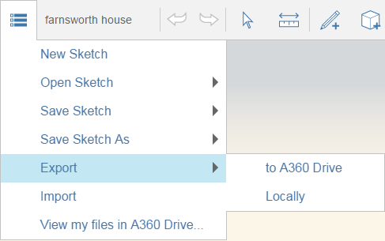

# Zusammenarbeit

---

Sie können gleichzeitig mit anderen Benutzern an derselben Skizze arbeiten oder Ihre Arbeit später freigeben. Anmerkung

Die Zusammenarbeit ist nur möglich, nachdem Sie FormIt 360 Pro aktiviert haben. Wenn Sie auf das Symbol für die Zusammenarbeit klicken, werden Sie aufgefordert, sich mit einem [http://360.autodesk.com](http://360.autodesk.com)-Konto mit Berechtigung für FormIt 360 Pro anzumelden.

* Sie können eine Sitzung für die Zusammenarbeit starten und anderen Ihren Entwurf und die von Ihnen vorgenommenen Änderungen zeigen.

Außer über die gleichzeitige Zusammenarbeit in freigegebenen Sitzungen können Sie die von Ihnen erstellten Arbeiten auch auf andere Weise weitergeben. Ob Sie Bilder Ihres Entwurfs per E-Mail senden oder Ihre Skizzen für die Verwendung in anderen Programmen exportieren: Es ist einfach, Ihre Arbeiten zur Prüfung an andere Benutzer weiterzuleiten.

* Um auf die Freigabeoptionen zuzugreifen, klicken Sie links oben in der Aktionsleiste auf das Symbol Datei. Um Ihre Arbeit freizugeben, können Sie sie entweder auf Ihr Autodesk 360-Laufwerk oder Ihr lokales Laufwerk exportieren. Weitere Informationen finden Sie unter [Exportieren von Dateien und Bildern](../../Manage Your Data/Export Files and Images.md).

#### Siehe auch

* [Exportieren von Dateien und Bildern](../../Manage Your Data/Export Files and Images.md)
* [ Speichern Ihrer Arbeiten](../../Manage Your Data/Saving Your Work.md)

#### Themen in diesem Abschnitt

* [Starten und Beenden freigegebener Sitzungen](../Start and Stop Collaborative Sessions.md)

Laden Sie andere Benutzer zur Mitarbeit am selben Entwurfsprojekt ein.

* [Teilnahme an einer Sitzung](../Joining a Session.md)

Nehmen Sie an der Zusammenarbeit teil.

* [Einladen anderer Benutzer zu einer Sitzung ](../Inviting Others to a Session.md)

Erstellen Sie ein Team für die Zusammenarbeit.

* [Einer Sitzungskamera folgen](../Following a Session Camera.md)

Betrachten Sie die Arbeiten aus der Perspektive eines anderen Teammitglieds.

* [Chatten mit Teamkollegen ](../Chat with Collaborators.md)

Beteiligen Sie sich an Gesprächen, während Sie am Entwurf arbeiten.

