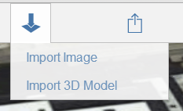

# Importieren von 3D-Modellen und Bildern

---

Sie können Ihren Entwürfen für eine Reihe von Verwendungszwecken Überlagerungen und Bilder hinzufügen.

Geländeüberlagerungen ergänzen Ihre Skizze um weitere Informationen oder dienen als Vorlage zum Nachzeichnen.

1. Wählen Sie die Schaltfläche Importieren aus der Aktionsleiste.

1. Wählen Sie ein Bild oder ein 3D-Modell aus Ihrem lokalen oder A360-Speicher.

Sie können das Bild skalieren und zuschneiden. Das Bild wird dann in den Arbeitsbereich importiert.

1. Verwenden Sie die Palette an der rechten Seite des Bildschirms, um Bildeigenschaften zu ändern.

Bearbeiten Sie gegebenenfalls den Namen und die Transparenz des Bildes. Sie können die verschiedenen Geländeüberlagerungen, darunter das Satellitenbild, auf unterschiedliche Weise übereinander anordnen.

