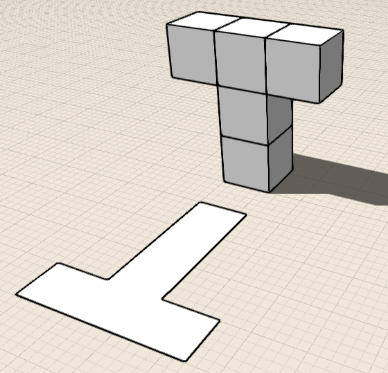

# Erstellen von Entwürfen

---

Sie können geometrische Formen auf Hintergrundrastern, Satellitenbildern oder Überlagerungen skizzieren oder platzieren.

* Mit Werkzeugen zur Erstellung von 2D- und 3D-Geometrie erstellen Sie Entwurfsmodelle. Beginnen Sie, indem Sie 2D-Formen skizzieren oder 3D-Grundkörper platzieren. Anschließend können Sie Ihre Entwürfe durch Schieben und Ziehen von Flächen sowie mithilfe verschiedener Transformationswerkzeuge und Boolescher Operationen bearbeiten. 

Es gibt zwei grundlegende Möglichkeiten zum Erstellen von Geometrie: Skizzieren von Formen und Platzieren von Grundkörpern. Sie können außerdem Geometrie importieren.

Zum Skizzieren stehen fünf Arten von Werkzeugen zur Verfügung: Linien, Bogen, Splines, Rechtecke und Kreise.

#### Skizzieren von Formen

* Erstellungswerkzeuge befinden sich in der Aktionsleiste. Zum Erstellen von Formen klicken Sie auf ein Werkzeug aus dem Werkzeugkasten Sketch. Klicken Sie dann in die Ansicht, um die Form zu definieren.

Es stehen fünf Arten dreidimensionaler Grundkörper zur Verfügung: Würfel, Kuppeln, Zylinder, Prismen und Pyramiden.

#### Platzieren von Grundkörpern

* Zum Platzieren von Grundkörpern klicken Sie auf ein Werkzeug aus dem Werkzeugkasten Geometry Creation. Klicken Sie dann in den Ansichtsbereich, um die Geometrie zu platzieren. 

Um komplexere Entwürfe zu erstellen, nachdem Sie eine Form skizziert oder einen Grundkörper eingefügt haben, können Sie die Geometrie mithilfe einer Reihe kontextabhängiger Werkzeuge bearbeiten. Zu diesen Operationen zählen: Auswählen, Löschen, Verschieben, Maßstab, Drehen, Extrusion, Fläche schneiden, Fläche versetzen, Neigen, Kopieren/Einfügen, Reihe, Abdeckung, Sweep, Erhebung und Boolesche Schnitt- und Vereinigungsfunktion. In den Themen in der folgenden Liste erfahren Sie mehr zu diesen Operationen.

#### Siehe auch

* [Ändern: Löschen/Bearbeiten/Verschieben](../../Modify Designs/Modify Delete, Edit, Move.md)
* [Ändern: Extrusion/Ausschneiden/Fläche versetzen ](../../Modify Designs/Modify Extrude, Cut-Offset Faces.md)
* [Ändern: Kante/Fläche wählen](../../Modify Designs/Modify Select Edge-Face or Object.md)
* [Ändern: Maßstab/Drehen ](../../Modify Designs/Modify Scale and Rotate.md)
* [Ändern: Neigen/Reihe/Kopieren/Einfügen ](../../Modify Designs/Modify Tilt, Array, Copy-Paste.md)
* [Ändern: Boolesche Operationen ](../../Modify Designs/Modify Boolean Operations.md)
* [Ändern: Abdeckung/Sweep/Erhebung ](../../Modify Designs/Modify Cover, Sweep, Loft.md)

#### Themen in diesem Abschnitt

* [Importieren von 3D-Modellen und Bildern ](../Import 3D Models and Images.md)

Sie können Ihren Entwürfen für eine Reihe von Verwendungszwecken Überlagerungen und Bilder hinzufügen.

* [Skizzieren von Formen](../Sketching Shapes.md)

Erstellen Sie aus Linien, Bogen, Splines, Rechtecken und Kreisen Formen, die Sie zu Gebäudeentwürfen zusammenfügen können.

* [Platzieren von Grundkörpern](../Place Primitives.md)

Verwenden Sie vordefinierte Formen als Bausteine für Entwürfe.

