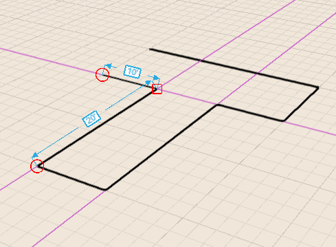
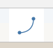

# Skizzieren von Formen

---

Erstellen Sie aus Linien, Bogen, Splines, Rechtecken und Kreisen Formen, die Sie zu Gebäudeentwürfen zusammenfügen können.

Nachdem Sie ein Zeichenwerkzeug ausgewählt haben, können Sie den Cursor an beliebiger Stelle im Zeichenbereich platzieren, um den Objektfang und Ableitungspunkte zu verwenden, bevor Sie den ersten Punkt festlegen.

## Verwenden von Linien

1. Platzieren Sie durch einfaches Klicken mit der Maus im Zeichenbereich den ersten Endpunkt der Linie.
2. Legen Sie den zweiten Endpunkt der Linie fest, indem Sie den Cursor entsprechend platzieren, den Objektfang/Ableitungen verwenden und klicken.
3. Um das nächste Liniensegment zu zeichnen, erstellen Sie einen weiteren Endpunkt durch Klicken an der gewünschten Position.

Wenn Sie damit beginnen, eine Linie entlang einer Achse zu zeichnen, können Sie sie durch Drücken der Umschalttaste auf diese beschränken. Dadurch können Sie die Linie verlängern, ohne von der Achse abzuweichen. Anmerkung: Mithilfe der Tabulatortaste öffnen Sie das Dialogfeld Set Length, in dem Sie einen Längenwert eingeben können. Wenn der Rasterfang deaktiviert ist, werden die Werte im Feld Set Length in ganzen Zahlen angezeigt, ist die Option aktiviert, in Bruchteilen von Fuß oder Metern.

## Verwendung von Bogen

1. Klicken Sie mit der Maus, um den ersten Endpunkt des Bogens zu platzieren.
2. Legen Sie auf dieselbe Weise den zweiten Endpunkt des Bogens fest, indem Sie den Cursor entsprechend platzieren, den Objektfang/Ableitungen verwenden und klicken.
3. Mit dem letzten Klick definieren Sie den Winkel des Bogens und schließen diesen ab. 
## Verwendung von Splines

1. Klicken Sie mit der Maus, um den ersten Endpunkt des Splines zu platzieren.
2. Legen Sie auf dieselbe Weise den zweiten Punkt des Splines fest, indem Sie den Cursor entsprechend platzieren, den Objektfang/Ableitungen verwenden und klicken. Anmerkung: Die Spline-Kurve wird automatisch eingeblendet.
3. Indem Sie auf den ursprünglichen Spline-Endpunkt klicken, erhalten Sie eine geschlossene Kontur aus Skizzenlinien und erstellen dadurch eine Ebene.
## Verwendung von Rechtecken

1. Klicken Sie mit der Maus, um die erste Ecke des Rechtecks zu platzieren.
2. Legen Sie auf dieselbe Weise die zweite Ecke des Rechtecks fest, indem Sie den Cursor entsprechend platzieren, den Objektfang/Ableitungen verwenden und klicken.
3. Legen Sie schließlich auf dieselbe Weise die dritte Ecke des Rechtecks fest.
## Verwendung von Kreisen

1. Klicken Sie mit der Maus, um den Mittelpunkt des Kreises zu platzieren.
2. Legen Sie auf dieselbe Weise den Radius des Kreises fest, indem Sie den Cursor entsprechend platzieren, den Objektfang/Ableitungen verwenden und klicken.

