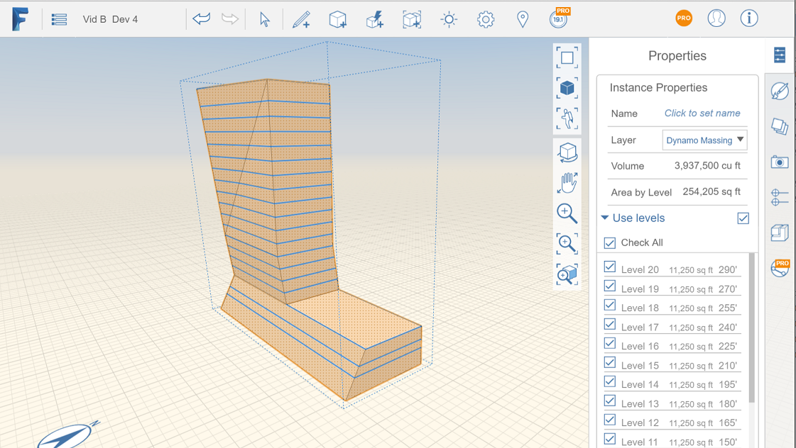

# Anwenden von Ebenen

---

Wie in Revit können Sie auch hier mithilfe von Ebenenwerten die Höhe bzw. das Geschoss in einer Gebäudeskizze definieren.

Weitere Informationen zu Ebenen finden Sie unter Info zu Ebenen.

## Ebenen auf Objekte anwenden

1. Wählen Sie das gesamte Objekt aus und öffnen Sie die Eigenschaftenpalette an der rechten Seite.
2. Aktivieren Sie das Kontrollkästchen Ebenen verwenden.
3. Aktivieren Sie das Kontrollkästchen für jede Ebene, die Sie auf das Objekt anwenden möchten.
4. In der Eigenschaftenpalette werden die Gesamtbruttofläche jeder Ebene sowie die Summe für das betreffende Objekt angezeigt.

5. 

