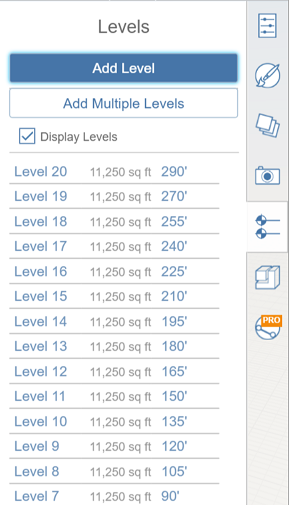
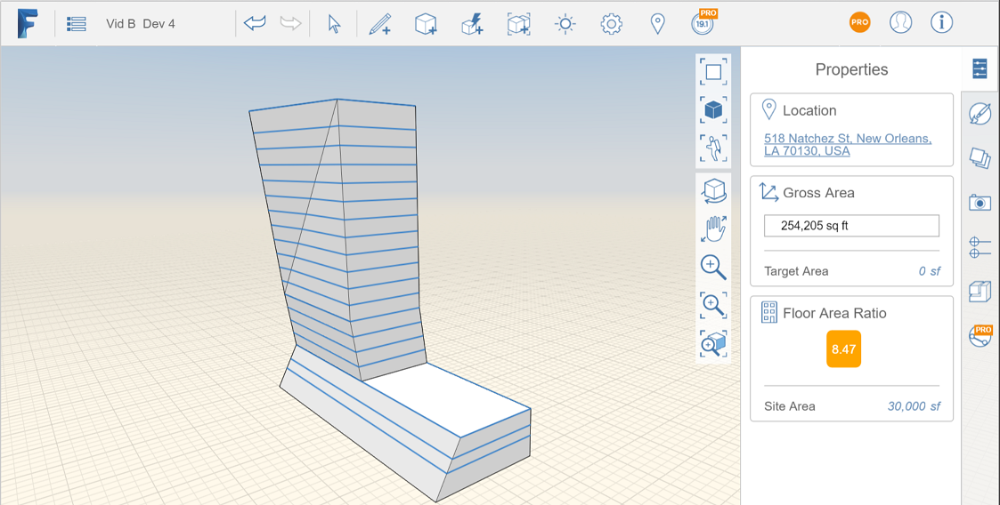

# Ebenen und Flächennutzung

---

Zeigen Sie Flächenberechnungen für Objekte in einem Entwurf an.

## Ebenen aktivieren

1. Um die Ebenenbezüge für die gesamte Skizze festzulegen, klicken Sie in der Palette auf der rechten Seite auf die Registerkarte Ebenen.
2. Bewegen Sie den Cursor über den Ebenentext und klicken Sie auf den blauen Bemaßungswert, um die Höhe jeder Ebene anzugeben.
3. Sie können auf die automatisch zugewiesenen Namen doppelklicken, um sie zu ändern (optional). Diese Ebenennamen werden den Ebenen nach der Konvertierung der Datei in Revit zugewiesen.
4. Sie können die Ebenen, die den einzelnen Objekten zugewiesen werden, auf der [Registerkarte Eigenschaften](../Apply Levels.md) festlegen.

5. 

## Eigenschaften und Flächennutzung

FormIt 360 führt laufend Protokoll über die in Ihrem Entwurf genutzte Bruttobodenfläche.

1. Nachdem Sie die Ebenen erstellt haben, [wenden Sie sie auf ein oder mehrere Objekte in der Szene an](../Apply Levels.md).
2. Öffnen Sie, ohne dass Objekte ausgewählt sind, die Eigenschaftenpalette, um die genutzte Bruttobodenfläche als Summe der Flächen der einzelnen Geschosse anzuzeigen.
3. Klicken Sie auf die Zahl neben Zielbereich, um eine Gesamtfläche für das Gebäudeprogramm zuzuweisen. Das Diagramm Bruttofläche zeigt jetzt die genutzte Fläche im Vergleich zu dieser Zielsumme.
4. Klicken Sie auf die Zahl neben Standortbereich, um die Gesamtfläche für die Baustelle zuzuweisen. Der Wert für Verhältnis Geschossdeckenfläche wird aus diesem Wert und der aktuellen Bruttofläche berechnet.

#### Siehe auch

* [Gebäudenutzbarkeit ](../../Building Performance/README.md)
* [Sonnen- und Schatteneinstellungen ](../../Building Performance/Sun and Shadow Settings.md)

#### Themen in diesem Abschnitt

* [Anwenden von Ebenen](../Apply Levels.md)

Wie in Revit können Sie auch hier mithilfe von Ebenenwerten die Höhe bzw. das Geschoss in einer Gebäudeskizze definieren.

