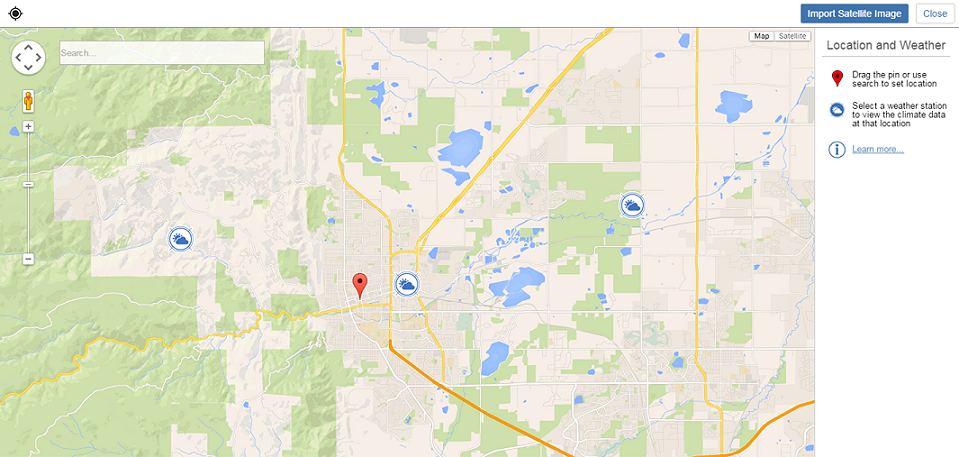

# Importieren eines Satellitenbilds

---

Gestalten Sie Ihren Entwurf detaillierter und wirklichkeitgetreuer.

Satellitenbilder und Daten aus Wetterstationen ergänzen Ihre Entwürfe um wichtige Informationen.

#### Satellitenbild importieren

1. Klicken Sie in der Aktionsleiste auf das Symbol Standort.
2. Sie können entweder nach einem bestimmten Standort suchen oder die Kartenansicht schwenken und zoomen, um den Standort zu ermitteln.
3. Wenn Sie den Standort gefunden haben, klicken Sie, um den roten Pin zu setzen.
4. Klicken Sie auf Satellitenbild importieren, um das Luftbild in der Skizze zu platzieren.
5. Verwenden Sie das daraufhin angezeigte Dialogfeld, um das Satellitenbild zuzuschneiden, sodass es den für Ihre Skizze relevanten Kontext zeigt.
6. Verwenden Sie eine der folgenden Vorgehensweisen:

* Klicken Sie auf Fertig stellen.

Durch diesen Vorgang gelangen Sie zurück zum Zeichenbereich, und der Standort des Projekts wird festgelegt, ohne das Satellitenbild zu importieren. Sie können später jederzeit zum Bildschirm Standort zurückkehren, um das Satellitenbild zu importieren.

* Klicken Sie auf Bildimport fertig stellen, um den Standort festzulegen und das dazugehörige Satellitenbild im Zeichenbereich hinzuzufügen.

1. Klicken Sie auf eine der in der Nähe gelegenen Wetterstationen, um historische Klimadaten für das Gebiet zu prüfen.
2. Klicken Sie auf das X in der rechten oberen Ecke, um die Anzeige der Wetterstation auszublenden.

