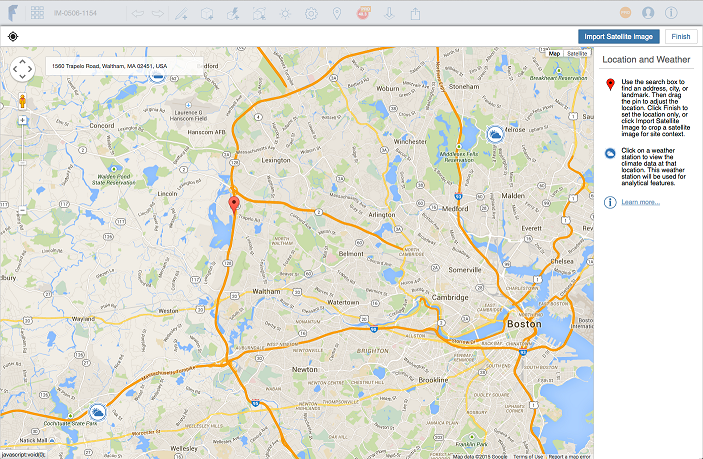

# Standort

---

Die Angabe des geografischen Standorts ermöglicht es, Daten zu Gebäudenutzbarkeit und Klima für Ihre Entwürfe zu verwenden.

Definieren Sie für eine maximale Funktionsfähigkeit Ihrer Entwürfe den geografischen Standort Ihrer Skizze mithilfe der Funktion Standort. Die Angabe des Standorts ist wichtig, damit Gebäudenutzbarkeitsdaten während der Arbeit am Entwurf verwendet werden können. Weitere Informationen finden Sie unter [Gebäudenutzbarkeit](../../Building Performance/README.md).

* Sie können Kontextgeometrie in den Formaten OBJ, STL oder AXM aus Ihrem lokalen Dateisystem [importieren](../../Creating Designs/Import 3D Models and Images.md).

#### Themen in diesem Abschnitt

* [Festlegen eines Standorts](../Set a Location.md)

Legen Sie den geografischen Standort für Ihre Skizze fest.

* [Importieren eines Satellitenbilds](../Import a Satellite Image.md)

Gestalten Sie Ihren Entwurf detaillierter und wirklichkeitgetreuer.

* [Bearbeiten, Neuladen oder Entfernen eines Satellitenbilds](../Edit, Reload, or Remove a Satellite Image.md)

Sie können Änderungen an den Bildern für Ihren Standort vornehmen.

