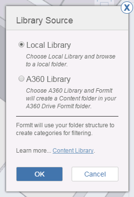
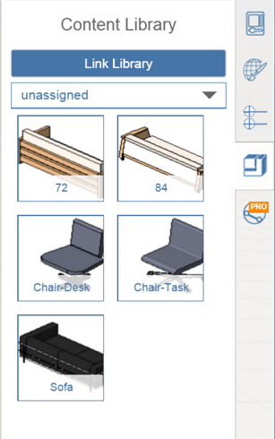

# Verknüpfen einer Inhaltsbibliothek

---

Zugriff auf zuvor gespeicherte Projekte und Grundstücksdateien.

1. Klicken Sie rechts neben dem Arbeitsbereich in der Eigenschaftenpalette auf das Symbol Inhaltsbibliothek.

2. Klicken Sie auf die Schaltfläche Bibliothek verknüpfen.
3. Wählen Sie den Speicherort für Ihre Bibliothek, entweder auf Ihrem lokalen Laufwerk oder auf einem A360 Drive.

4. Navigieren Sie im Dialogfeld für die Dateinavigation zum Ordner auf oberster Ebene in Ihrer Inhaltsbibliothek.
5. Wählen Sie eine Inhaltsdatei aus.

