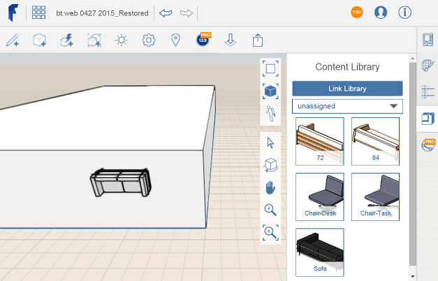

# Platzieren von Inhalten

---

Verwendung von Daten aus einer Inhaltsbibliotheksdatei in Entwürfen.

Anmerkung: Wenn Sie Ihre Bibliothek lokal verknüpft haben und anschließend eine neue FormIt-Internetsitzung starten, müssen Sie die Inhaltsbibliothek erneut verknüpfen.

1. Bewegen Sie den Mauszeiger über die benötigte Miniaturansicht.
2. Ziehen Sie den Inhalt in den Arbeitsbereich und legen Sie ihn dort ab oder klicken Sie auf die Miniaturansicht, bewegen Sie den Mauszeiger in den Arbeitsbereich und klicken Sie erneut, um den Inhalt zu platzieren.

