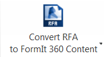
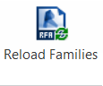

# FormIt 360 Converter

---

Konvertieren von Dateien aus anderen Anwendungen für die Verwendung in FormIt 360

FormIt 360 Converter ist ein Revit-Zusatzmodul zum Konvertieren von Dateien aus anderen Anwendungen wie SketchUp und Revit für die Verwendung in FormIt 360. Sie können es direkt von der [FormIt 360-Website](http://formit360.autodesk.com/blog/formit-converter/) herunterladen.

## Konvertieren von RFA-Dateien in FormIt 360-Dateien 

1. Wählen Sie im Multifunktionsleistenmenü die Option Convert RFA to FormIt 360 Content.
2. Navigieren Sie zum lokalen Verzeichnis mit den RFA-Dateien, die Sie in FormIt 360-Inhalte konvertieren möchten.
3. Navigieren Sie zum lokalen Verzeichnis, in dem die konvertierten FormIt 360-Inhalte abgelegt werden sollen.
4. (Optional) Aktivieren Sie die Option Upload to A360 Drive Content Folder.
5. Klicken Sie auf OK. Revit konvertiert daraufhin alle RFA-Dateien in FormIt 360-Inhalte (AXM-Dateien). Nur die folgenden Kategorien werden unterstützt, alle anderen werden ignoriert: Schreinerarbeiten, Umgebung, Möbel, Möbelsysteme, allgemeine Modelle, Parkplätze, Grundstück, Sonderausstattung, Körper.

Wenn Sie die Dateien auf das A360-Laufwerk hochladen möchten, werden Sie zunächst zur Anmeldung bei Autodesk 360 aufgefordert (falls Sie noch nicht bei Revit angemeldet sind). Die AXM-Dateien werden auf Ihrem A360-Laufwerk im folgenden Ordner abgelegt: /FormIt/Content. Weitere Informationen zur Verwendung dieser Inhalte in FormIt 360 finden Sie unter [Inhaltsbibliothek](../Content Libraries/README.md).

## Konvertieren von FormIt 360-Skizzendateien (AXM) in Revit-Projekte 

1. Laden Sie eine FormIt 360-Skizze (.axm) von Ihrem A360-Laufwerk herunter.
2. Starten Sie Revit 2015 und erstellen Sie ein neues Projekt.
3. Wählen Sie im Zusatzmodul die Option Convert FormIt 360 Sketch to RVT und navigieren Sie zu der heruntergeladenen AXM-Datei.
4. Das Zusatzmodul konvertiert die Geometrie aus der FormIt 360-Datei und platziert sie in der momentan geöffneten RVT-Datei.
1. Skizzierte extrudierte Objekte werden in Körperfamilien konvertiert.
2. Gruppierte Objekte, die kopiert werden, werden als Exemplare derselben Körperfamilie platziert.
3. Gruppen, denen in FormIt 360 eine bestimmte Kategorie zugewiesen wurde, werden als Familie derselben Kategorie platziert. Sie können diese Familien manuell durch beliebige andere Revit-Familien derselben Kategorie ersetzen.
4. Inhalte, die mithilfe dieses Zusatzmoduls konvertiert wurden, werden als Familien derselben Kategorie platziert. Sie können diese Familien mithilfe der Funktion Neu laden durch die eigentlichen RFA-Dateien ersetzen (siehe unten).

## Konvertieren von SketchUp-Dateien (SKP) in FormIt 360-Skizzendateien 

1. Wählen Sie im Multifunktionsleistenmenü die Option Convert SKP to FormIt 360 Content.
2. Navigieren Sie zum lokalen Verzeichnis mit den SKP-Dateien, die Sie in FormIt 360-Inhalte konvertieren möchten.
3. Navigieren Sie zum lokalen Verzeichnis, in dem die konvertierten FormIt 360-Inhalte abgelegt werden sollen.
4. (Optional) Aktivieren Sie die Option Upload to A360 Drive Content Folder.
5. Klicken Sie auf OK. Revit konvertiert daraufhin alle SKP-Dateien in FormIt 360-Inhalte (AXM-Dateien).

Wenn Sie die Dateien auf das A360-Laufwerk hochladen möchten, werden Sie zunächst zur Anmeldung bei Autodesk 360 aufgefordert (falls Sie noch nicht bei Revit angemeldet sind). Die AXM-Dateien werden auf Ihrem A360-Laufwerk im folgenden Ordner abgelegt: /FormIt/Content. Weitere Informationen zur Verwendung dieser Inhalte in FormIt 360 finden Sie unter [Inhaltsbibliothek](../Content Libraries/README.md).

## Ersetzen von FormIt 360-Inhalten durch Revit-Familien 

1. Konvertieren Sie eine FormIt 360-Skizze in eine RVT-Datei wie oben beschrieben.
2. Wählen Sie im Zusatzmodul die Option Reload Families.
3. Navigieren Sie zu einem lokalen Verzeichnis mit den RFA-Dateien, die konvertierten FormIt 360-Inhalten entsprechen.
4. Das Zusatzmodul ersetzt die betreffenden Familien durch die entsprechenden im ausgewählten Verzeichnis gefundenen Familien.

