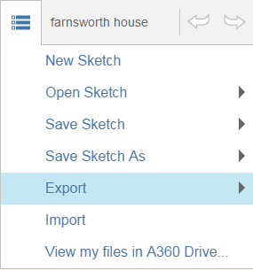

# Speichern Ihrer Arbeiten

---

Ihre Entwürfe bleiben in unterschiedlichen Formaten unverändert erhalten.

* Sie können alle Ihre Skizzen entweder auf einem lokalen Laufwerk oder auf [http://360.autodesk.com](http://360.autodesk.com) speichern und dort auf sie zugreifen.

Beim Speichern einer Skizze auf [http://360.autodesk.com](http://360.autodesk.com) werden drei Dateien in den Formaten AXM, SAT und RVT (letztere zum Öffnen in auf Revit-Software basierenden Produkten) erstellt.  Die Revit-Datei kann lokal heruntergeladen und direkt in Revit geöffnet werden.

