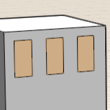
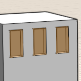

# Info zur intelligenten Auswahl

---

Mithilfe der Tabulatortaste können Sie ähnliche Objekte leichter auswählen.

Verwenden Sie die Tabulatortaste, um Geometrie schneller zu platzieren und zu bearbeiten.

* Auswahl von Flächen gleicher Größe: Setzen Sie den Cursor auf eine Fläche und drücken Sie die Tabulatortaste. Daraufhin werden alle Flächen mit dieser Größe an diesem Körper hervorgehoben. Durch einfaches Klicken wählen Sie alle diese Flächen aus.

* Auswahl einer Gruppe von Flächen: Setzen Sie den Cursor auf eine Fläche, die einer Gruppe von Flächen angehört, und drücken Sie zweimal die Tabulatortaste. Alle zu dieser Gruppe gehörenden Flächen werden hervorgehoben. Durch einfaches Klicken wählen Sie alle diese Flächen aus.

* Auswahl von Flächengruppen gleicher Größe: Setzen Sie den Cursor auf eine Fläche, die einer Gruppe von Flächen angehört, und drücken Sie dreimal die Tabulatortaste. Alle Flächengruppen dieser Größe werden hervorgehoben. Durch einfaches Klicken wählen Sie alle diese Flächengruppen aus.

* Auswahl nach Tiefe: Setzen Sie den Cursor auf eine in einem Gruppenexemplar oben liegende Fläche, gehen Sie mithilfe der Leertaste die Auswahloptionen in derselben Ebene durch, und klicken Sie auf die gewünschte Fläche.

