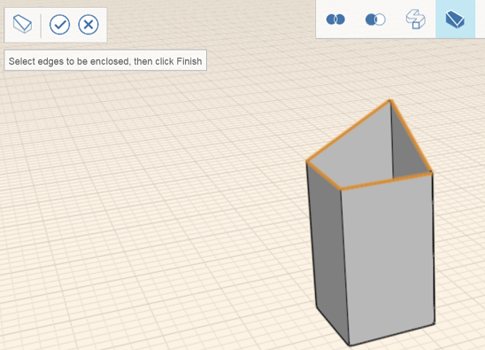
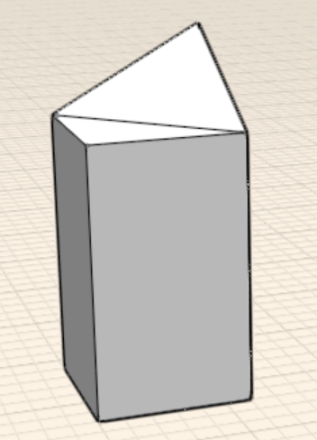
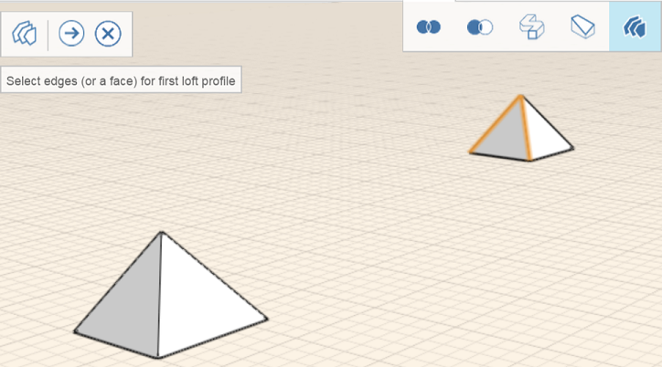

# Ändern: Überdeckung, Sweep, Erhebung

---

Diese Funktionen ermöglichen es, offene Kanten zu schließen, Geometrieänderungen vorzunehmen, die einem aus Kanten bestehenden Pfad folgen, und mehrere Profile oder Kanten zu verbinden.

#### So schließen Sie eine Reihe von Flächen

1. Klicken Sie in der Aktionsleiste auf das Werkzeug Abdeckung .
2. Klicken Sie auf die Kanten des abzudeckenden Objekts.

3. Klicken Sie auf Fertig stellen .

#### So ändern Sie die Geometrie entlang einem Pfad

1. Markieren Sie eine Fläche eines zu schneidenden Objekts.

2. Klicken Sie auf das Symbol des Werkzeugs Sweep.
3. Wählen Sie die zuvor markierte Fläche aus.

4. Wählen Sie die zu bearbeitende Kante aus.

5. Klicken Sie auf Fertig stellen .

Das Originalobjekt wird am Sweep-Pfad entlang geändert.

#### So verbinden Sie mehrere Profile oder Kanten

1. Klicken Sie auf das Symbol Erhebung.
2. Klicken Sie auf die Kanten des ersten Objekts und dann auf den Pfeil.

3. Klicken Sie auf die Kanten des zweiten Objekts.

4. Klicken Sie auf Fertig stellen .

