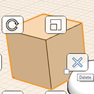

# Ändern: Löschen, Bearbeiten, Verschieben

---

Sie können Objekte entfernen, neu positionieren oder ihre Eigenschaften ändern.

1.  Um Geometrie zu löschen, müssen Sie sie zunächst auswählen. Öffnen Sie dann durch Rechtsklicken das Kontextmenü und klicken Sie dort auf das Symbol Löschen. Alternativ können Sie die Entf-Taste auf der Tastatur drücken.
2. Bei vielen der Bearbeitungswerkzeuge, etwa Verschieben, Reihe, Fläche schieben/ziehen und Versetzen, wird ein blauer Rahmen für die Bemaßung angezeigt. Nachdem Sie Ihren Vorgang abgeschlossen haben, können Sie auf diese Bemaßung klicken und einen bestimmten Wert eingeben. Sie können auch die Tabulatortaste drücken, um das Dialogfeld Bemaßung bearbeiten aufzurufen.
3.  Um Kanten, Flächen oder Objekte zu verschieben, wählen Sie sie zunächst aus. Dadurch wird automatisch das Werkzeug Verschieben aktiviert. Setzen Sie den Cursor an die gewünschte Stelle, um Fang- und Ableitungspunkte für den Anfangspunkt der Verschiebung einzublenden, und klicken Sie, um zu beginnen. Setzen Sie jetzt den Cursor an die benötigte Stelle für die Anzeige von Fang- und Ableitungspunkten für die Zielposition der Verschiebung. Klicken Sie erneut, um das Objekt zu platzieren.

