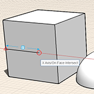

# Ändern: Extrudieren, Flächen ausschneiden/versetzen

---

Es ist möglich, Flächen zu verschieben oder zu ziehen, neue Formen auf bestehenden anzubringen oder neue Kanten mit einem Versatz von den bestehenden zu erstellen.

1.  Um eine Fläche zu schieben oder zu ziehen, wählen Sie sie durch einfaches Klicken aus und ziehen Sie sie bei gedrückter Maustaste. Die Fläche wird vorwärts und rückwärts verschoben und sie können für die Bewegung mit der Maus den Objektfang und Ableitungen an anderen Modellelementen verwenden. Klicken Sie erneut, um die Verschiebung der Fläche zu beenden. Halten Sie die Strg-Taste gedrückt, wenn die Originalkanten erhalten bleiben sollen.
2.  Um Formen aufzuprägen, zeichnen Sie mithilfe eines 3D-Skizzierwerkzeugs Linien, Bogen, Splines, Rechtecke oder Kreise auf bestehende Flächen. Durch diese Aktion erstellen Sie neue Flächen, die Sie unabhängig von der Originalfläche schieben oder ziehen können.
3.  Um eine Fläche zu versetzen, wählen Sie diese zunächst aus und klicken Sie dann im Kontextmenü auf das Werkzeug Versetzen. Bewegen Sie dann den Cursor über die Fläche, um eine gegenüber den ursprünglichen Kanten versetzte Gruppe von Kanten zu erstellen.

