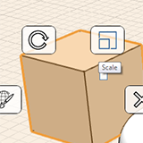

# Ändern: Maßstab und Drehen

---

Sie können die Größe und Ausrichtung von Objekten anpassen.

1. Um Kanten, Flächen oder Objekte zu skalieren, wählen Sie sie aus, klicken Sie mit der rechten Maustaste, um das Kontextmenü aufzurufen, und wählen Sie das Symbol Maßstab. Skalieren Sie die Geometrie mithilfe des Mausrads.
2.  Um Kanten, Flächen und Objekte zu drehen, wählen Sie die Elemente aus, klicken Sie mit der rechten Maustaste und wählen Sie das Werkzeug Drehen aus dem Kontextmenü. Am Mauszeiger wird ein Winkelmesser angezeigt. Klicken Sie, um die Ebene für die Drehung festzulegen. Sie können gegebenenfalls mithilfe der blauen Griffe den Startpunkt der Drehung angeben und die Achse neu festlegen. Mithilfe der Pfeile oder des bearbeitbaren Bemaßungsfelds können Sie den Drehwinkel einstellen. Sie können das Werkzeug Drehen auch mithilfe der Taste Q aufrufen, nachdem Sie ein Element ausgewählt haben.

