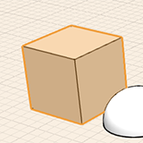
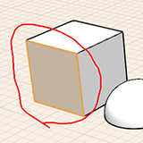

# Ändern: Kante/Fläche oder Objekt auswählen

---

Die Auswahl eines Objekts oder einer Oberfläche ist der erste Schritt bei der Bearbeitung.

1. Um eine Fläche, eine Kante oder einen Scheitelpunkt auszuwählen, zeigen Sie mit dem Cursor darauf und klicekn einmal.
2.  Durch Doppelklicken wählen Sie das gesamte Objekt aus.
3.  Zur Auswahl mehrerer Geometrieobjekte auf einmal verwenden Sie die Fensterauswahl. Stellen Sie sicher, dass nicht ausgewählt ist. Dann können Sie klicken und die Maus entweder von links nach rechts oder von rechts nach links ziehen.
4. Verwenden Sie das Lassowerkzeug, wenn Sie mehrere Geometrieobjekte mit größerer Präzision auswählen möchten. Es steht im Kontextmenü zur Verfügung, das Sie durch Rechtsklicken im leeren Arbeitsbereich aufrufen. Zeichnen Sie dann eine Linie um den gewünschten Auswahlbereich.

