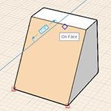
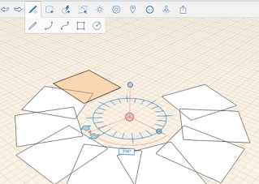

# Ändern: Neigen, Reihe, Kopieren/Einfügen

---

Durch Änderungen an den gezeichneten Formen können Sie komplexere Entwürfe erstellen.

## Ändern von Geometrie

Um komplexere Entwürfe zu erstellen, nachdem Sie eine Form skizziert oder einen Grundkörper eingefügt haben, können Sie die Geometrie mithilfe einer Reihe kontextabhängiger Werkzeuge bearbeiten. Zu diesen Operationen zählen: Neigen, Facettieren (nur Web), Kopieren/Einfügen und Reihe.

1. Um eine Fläche zu neigen, wählen Sie sie aus, und klicken Sie mit der rechten Maustaste, um das Kontextmenü anzuzeigen. Wählen Sie dann das Neigungssymbol aus dem Kontextmenü. Definieren Sie anschließend die Neigungsachse, indem Sie eine Linie zeichnen. Klicken Sie auf einen dritten Punkt, um die Fläche zu neigen.
2.  Wenn Sie den Cursor auf eine Fläche setzen und dabei gepunktete Linien angezeigt werden, bedeutet dies, dass die Fläche sich aus kleineren Flächen zusammensetzt, da sie gekrümmt ist. Um die gepunkteten Linien in Modellkanten zu konvertieren, wählen Sie zunächst die Fläche bzw. das Objekt aus und klicken Sie mit der rechten Maustaste, um das Kontextmenü einzublenden. Wählen Sie dann das Facettierungssymbol aus dem Kontextmenü. Dadurch werden der zuvor glatten Fläche Kanten hinzugefügt.
3. Zum Kopieren und Einfügen von Flächen, Kanten oder Objekten wählen Sie diese zunächst aus, und wählen Sie dann das Symbol zum Kopieren aus dem Kontextmenü. Rufen Sie dann zum Einfügen das Kontextmenü erneut auf. Beim Einfügen stehen Optionen für Objektfang und abgeleitete Abhängigkeiten zur Verfügung. Halten Sie die Strg-Taste gedrückt, und ziehen Sie ein Objekt, um rasch eine Kopie zu erstellen.
4.  Um Reihen für Kanten, Flächen oder ganze Objekte zu erstellen, wählen Sie im Kontextmenü das Reihensymbol. Sie können sowohl lineare als auch radiale Reihen erstellen. Wählen Sie als Nächstes entweder Linear oder Radial, und geben Sie die übrigen Parameter an. Klicken Sie dann ähnlich wie beim Werkzeug Verschieben auf das Objekt, um die Reihe zu beginnen, und klicken Sie erneut, um die Elemente der Reihe zu platzieren.

