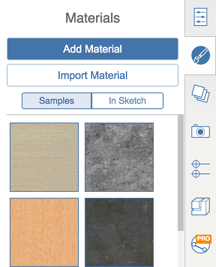
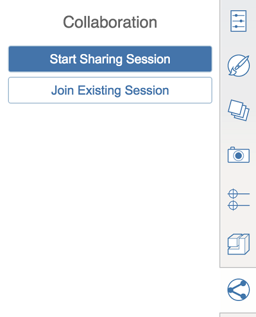

# Kontextmenü und Paletten rechts auf dem Bildschirm

---

Hier befinden sich die Werkzeuge zum Erstellen und Platzieren von Entwürfen.

Die Benutzeroberfläche der Software nutzt ein Kontextmenü und eine Palette.

* Das Kontextmenü rufen Sie durch Rechtsklicken auf ein Objekt oder eine leere Stelle auf. Entsprechend Ihrer Auswahl werden im Kontextmenü unterschiedliche Werkzeuge angezeigt, mit denen Sie die Auswahl bearbeiten können.

   Kontextmenü für Arbeitsbereich     Kontextmenü für Volumenkörper     Kontextmenü für Gruppen     Kontextmenü für Fläche 

## Paletten

|
|
|
| -- | -- |
|Klicken Sie auf das Palettensymbol, um die Eigenschaftenpalette ein- oder auszublenden. Auf der Registerkarte Eigenschaften können Sie den Namen sowie die Einstellungen für Ebenen und Layer eines Objekts verwalten und Informationen zu Fläche und Volumen des ausgewählten Objekts anzeigen.||
|Auf der Registerkarte Materialien können Sie Materialien erstellen, bearbeiten und auf Objekte anwenden.||
|Auf der Registerkarte Ebenen können Sie die Ebenen in Ihrer Skizze erstellen und bearbeiten. Es ist hier jedoch nicht möglich, Ebenen für Elemente festzulegen. Verwenden Sie hierfür die Registerkarte Eigenschaften.||
|Verwenden Sie die Inhaltsbibliothek, um eine Bibliothek auf Ihrem lokalen Computer oder aus A360 Drive zu verknüpfen. Anschließend können Sie Inhalte aus der Bibliothek in Ihre FormIt 360-Skizze ziehen und ablegen.||
|Über Collaboration können Sie gleichzeitig mit anderen Benutzern an Entwürfen arbeiten.||
|Auf der Layer-Palette können Sie Layer erstellen und ändern. Darüber hinaus können sie die momentan ausgewählten Objekte einem bestimmten Layer hinzufügen.||
|In der Szenenpalette können Sie Szenen erstellen und bearbeiten. Klicken Sie auf Wiedergabe, um alle Szenen in der aktuellen Datei der Reihe nach wiederzugeben.||

