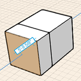

# Navigationswerkzeuge

---

Die folgenden Funktionen stehen in der Benutzeroberfläche zur Verfügung.

Wichtige Werkzeuge zum Navigieren im Entwurfsbereich.

### Ansichtsmodi

| | |
| ---- | ---- |
| Draufsicht|Anzeige Ihres Projekts von oben. In dieser Ansicht ist das Umkreisen nicht möglich, Schwenken und Zoom können jedoch normal verwendet werden. Diese Ansicht ist besonders hilfreich beim Skizzieren von Grundrissen über einer importierten Skizze oder einem Satellitenbild. |
| 3D-Ansicht|Dies ist die perspektivische Ansicht, mit der FormIt 360 gestartet wird. Sie können Ihr Modell umkreisen, schwenken und zoomen, um es anzuzeigen und zu bearbeiten. |
| 3D-Navigationsmodus|Wechselt in einen perspektivischen Begehungsmodus auf Bodenebene. Die Bearbeitungswerkzeuge sind deaktiviert, Sie können sich jedoch mithilfe der Leertaste und anderer Tastaturbefehle im 2D- und 3D-Modus durch das Modell bewegen. Wenn Sie diesen Modus mithilfe der Esc-Taste beenden, kehren Sie in den 3D-Ansichtsmodus zurück, wobei Ihr aktueller Blickpunkt erhalten bleibt. |

### Navigieren in der Ansicht

| | | |
| ---- | ---- | ---- |
| Schwenken | Mittlere Maustaste drücken und ziehen |  |
| Orbit | Mit der rechten Maustaste klicken und Maus ziehen | |
| Vergrößern/Verkleinern | Mittlere Maustaste/Mausrad |  |

### Gesten zum Erstellen von Geometrie

| | | |
| ---- | ---- | ---- |
| Objekte kopieren | Objekt wählen, Strg + C, dann klicken, Strg + V |  |
| 2D-Formen zeichnen | Klicken Sie auf eines der Werkzeuge Linie, Bogen, Spline, Kreis oder Rechteck, und zeichnen Sie durch Klicken im Zeichenbereich. |  |
| Formen extrudieren | Klicken Sie auf eine Fläche, um sie auszuwählen. Ziehen Sie bei gedrückter Maustaste, und klicken Sie schließlich erneut, um die Extrusion der Fläche abzuschließen. |  |
| Grundkörper platzieren | Klicken Sie in der Aktionsleiste auf einen Grundkörper und dann in den Zeichenbereich. |  |

#### 3D-Navigationsmodus

* Im 3D-Navigationsmodus können Sie die Perspektive für den Blickwinkel der Kamera in Ihrem Entwurf wählen. Darüber hinaus können Sie ein automatisches Luftbild als Überblick über den Zeichenbereich erstellen. Verwenden Sie zum Wechseln in den 3D-Navigationsmodus das Jetpack-Symbol.

### Tastaturkurzbefehle für den 3D-Navigationsmodus

| | |
| ---- | ---- |
| 2D-Navigation | W – Vorwärts, S – Rückwärts, A – Links, D – Rechts |
| 3D | Q – Schritt nach oben, E – Schritt nach unten |
| Jetpack | Leertaste bewirkt "Abheben" |
| Umsehen | Mauszeiger an den Zielpunkt für die Blickrichtung |
| Beenden | Esc drücken, um den 3D-Navigationsmodus zu beenden |

