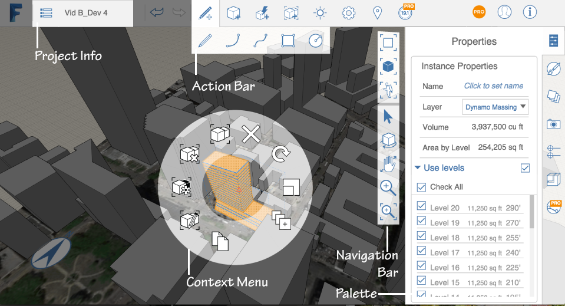

# Benutzerinteraktion

---

Hier befinden sich die Werkzeuge zum Erstellen und Platzieren von Entwürfen.

Die Benutzeroberfläche der Software nutzt das Standardinteraktionsmodell der jeweiligen Plattform.

* Die wichtigsten Komponenten der Benutzeroberfläche von FormIt 360 sind die folgenden (Tipps zur Interaktion mit der FormIt 360-Software finden Sie unter [Navigationswerkzeuge](../Navigation Tools.md)):

#### Themen in diesem Abschnitt

* [Kontextmenü und Paletten rechts auf dem Bildschirm](../Context Menu and Right-Side Palettes.md)

Hier befinden sich die Werkzeuge zum Erstellen und Platzieren von Entwürfen.

* [Werkzeuge der Benutzeroberfläche ](../User Interface Tools.md)

Referenz zu den Werkzeugen für Befehlsinteraktion.

* [Referenz zu Projektinformationen ](../Project Information Reference.md)

Benennen Sie Ihren Entwurf und überwachen Sie seinen Status.

* [Navigationswerkzeuge](../Navigation Tools.md)

Diese Funktionen stehen für die Interaktion mit der Benutzeroberfläche zur Verfügung.

* [Tastaturkürzel](../Keyboard Shortcuts.md)

Beschleunigen Sie Ihre Arbeit mit Tastaturkurzbefehlen.

