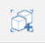

# Werkzeuge der Benutzeroberfläche

---

Referenz zu den Werkzeugen für Befehlsinteraktion.

## Informationsbereich

*  Skizze speichern: Klicken Sie hier, um die aktuelle Skizze zu speichern oder eine neue zu öffnen.
* Namen festlegen: Klicken Sie hier, um den Namen der Skizze zu ändern.
* Rückgängig und Wiederherstellen: Klicken Sie hier, um zuletzt ausgeführte Aktionen rückgängig zu machen oder zu wiederholen.
* *Navigationsleiste*

    | | |
    | ---- | ---- |
|  | *Ansicht von oben*: Zu orthogonaler Ansicht mit Blickrichtung von oben wechseln   *3D-Ansicht*: Zurück zur vorgegebenen perspektivischen 3D-Ansicht  *Jetpack*: Zu einer Walkthrough-Ansicht wechseln, die mithilfe gängiger Gaming-Bedienelemente gesteuert wird. W – Vorwärts, S – Rückwärts, A – Links, D – Rechts, Q – Nach oben, F – Nach unten, Leertaste zum "Fliegen"  *Auswahl*: Zurück zum Auswahlmodus  *Orbit*  *Pan*  *Zoom*  *An Fenstergröße anpassen*  |

## Aktionsleiste

* Die Aktionsleiste befindet sich am oberen Rand des Bildschirms. Die Werkzeuge in der Aktionsleiste ermöglichen das Erstellen, Bearbeiten und Freigeben von Inhalten.

* Benutzer-ID, Hilfeleiste 

* : Auswahlfilter: Klicken Sie hier, um Optionen zum Filtern von Objekttypen aus dem Auswahlwerkzeug zu wählen.

* Messwerkzeuge: Klicken Sie hier, um ein Werkzeug für Linear- oder Winkelmessung zu wählen.
* Skizzierwerkzeuge: Klicken Sie hier, um ein Menü mit Erstellungswerkzeugen aufzurufen, mit deren Hilfe Sie Formen zeichnen können.
* Grundkörper: Klicken Sie hier, um ein Menü mit einfachen 3D-Formen aufzurufen, die Sie in Ihrer Szene platzieren können.
* Erweiterte Werkzeuge: Klicken Sie hier, um Boolesche Schnitt- und Vereinigungsfunktionen, Überdeckungen, Sweeps oder Erhebungen zu verwenden.
* Gruppen: Hier finden Sie Werkzeuge für die Gruppierung von Objekten.
*  Sonne und Schatten: Mit diesem Werkzeug ändern Sie das Datum und die Uhrzeit, um den Schattenwurf in Ihrem Modell zu beobachten. Weitere Informationen zu Sonne und Schatten finden Sie unter [Sonnen- und Schatteneinstellungen](../../Building Performance/Sun and Shadow Settings.md). Starten Sie die Solaranalyse über diesen Bereich.
* Einstellungen: Hier können Sie Anwendungs- und Skizzeneinstellungen, den Bildstil sowie Diagnosefunktionen für das Modell festlegen.
* Suche nach einem Standort und Importieren von Satellitenbildern in Ihre Skizze. Weitere Informationen zum Festlegen des Standorts der Skizze.
* Energieanalyse: Klicken Sie hier, um Berechnungen für den Energieverbrauch eines Gebäudes durchzuführen.
* Bilder und Modelle importieren: Mithilfe dieses Werkzeugs können Sie Bilder und Modelle hinzufügen, die Sie in anderen Programmen erstellt haben.
* Ihre Arbeiten freigeben: Exportieren Sie Ihr Modell in verschiedene Formate.
*  Zugriff auf Funktionen für Solaranalyse, Energieanalyse und Zusammenarbeit
* Anmeldung bei Autodesk 360: Autodesk 360 Cloud-Services kostenlos zum Speichern und Freigeben Ihrer Skizzen.
* Hilfe: Mithilfe der Informationswerkzeuge lernen Sie FormIt noch besser kennen.

## Palettenleiste

Die Palettenleiste wird auf der rechten Seite des Bildschirms angezeigt. Durch Klicken auf eines dieser Symbole öffnen Sie eine seitliche Palette mit Gebäudeeigenschaften, Materialien, einer Inhaltsbibliothek sowie Werkzeugen für die Zusammenarbeit.

| | |
| ---- | ---- |
|  | *Eigenschaften*: Öffnen Sie diese Palette, um den Standort, die Bruttofläche sowie Bodenflächenverhältnisse für Ihre Skizze anzuzeigen.*Materialien*: Verwenden Sie diese Palette zum Erstellen oder Anwenden von Materialien.*Layer*: Erstellen und Verwalten von Layern und Zuweisen ausgewählter Objekte zu verschiedenen Layern*Szenen*: Erstellen, Verwalten und Wiedergeben von Szenen*Ebenen*: Verwenden Sie diese Palette zum Anzeigen und Hinzufügen von Ebenen zu Gebäudeobjekten.*Inhaltsbibliothek*: In der Inhaltsbibliothek können Sie wiederverwendbare Inhalte wie etwa Möbel speichern.*Zusammenarbeit* (nur FormIt 360 Pro): Mithilfe dieser Funktion können Sie gleichzeitig mit anderen Benutzern an Entwürfen arbeiten. |

