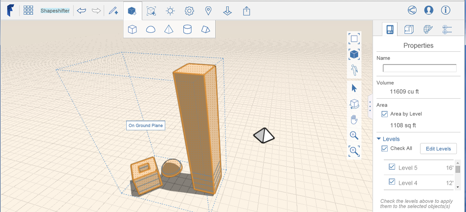
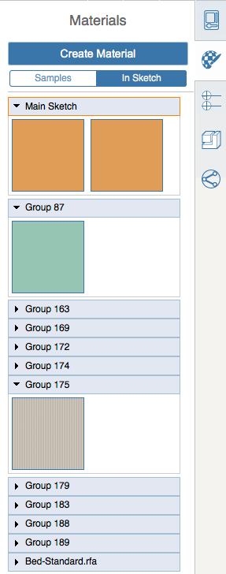

# Anwenden von Ebenen und Materialien auf eine Gruppe

---

Ein Verfahren zur gleichzeitigen Bearbeitung mehrerer Objekte

## Ebenen anwenden

1. Wählen Sie ein Objekt aus der Gruppe aus, wechseln Sie jedoch nicht in den Bearbeitungsmodus.
2. Öffnen Sie die Eigenschaftenpalette rechts.
3. Aktivieren Sie die Option Bereich nach Ebene und wählen Sie unter Ebenen die Ebenen, die auf die ausgewählten Objekte angewendet werden sollen.
## Material anwenden

| | |
| ---- | ---- |
|  1. Wählen Sie eine Gruppe aus, doppelklicken Sie darauf, um sie bearbeiten zu können, und öffnen Sie die Palette rechts auf dem Bildschirm. 2. Verwenden Sie die Registerkarte Materialien, um in den bereitgestellten Beispielen nach einem Material zu suchen und es anzuwenden oder [ein neues zu erstellen](../../Visualizing Your Design/Using Materials/Apply a Material.md) . 3. Um ein Material, das in einer Gruppe erstellt wurde, auf eine andere Gruppe anzuwenden, klicken Sie in der Materialpalette auf die Registerkarte In Skizze. 4. Durchsuchen Sie die Liste der Gruppen nach dem Material, das Sie auf die aktuelle Gruppe anwenden möchten. 5. Setzen Sie den Cursor auf das Material, klicken Sie auf das Pinselsymbol und wenden Sie das Material auf die ausgewählten Flächen an. Anmerkung: Es ist auch möglich, Materialien auf einzelne Gruppenexemplare anzuwenden, ohne die Gruppe zu bearbeiten.  |  |
| |     |

