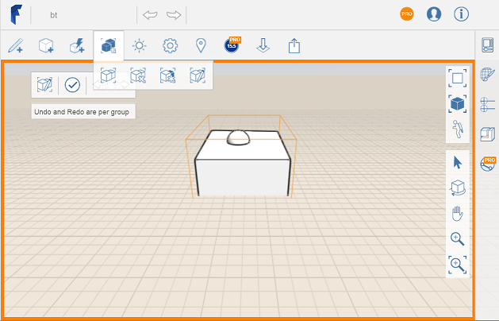

# Gruppe bearbeiten

---

Sie können bestehende Gruppen aktualisieren oder ändern.

1. Klicken Sie im Werkzeugkasten auf das Symbol Gruppen bearbeiten. 
2. Klicken Sie auf die Gruppe, die Sie bearbeiten möchten.
3. Bearbeiten Sie die Geometrie und damit die Gruppenobjekte.
4. Wenn Sie die Bearbeitung abgeschlossen haben, klicken Sie auf (Fertig stellen) in der linken oberen Ecke.

