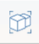

# Gruppieren von Objekten und Aufheben der Gruppierung

---

Nehmen Sie Geometrie zur einfacheren Bearbeitung in Gruppen auf.

#### Gruppieren von Objekten

1. Klicken Sie im Werkzeugkasten auf das Symbol Gruppe. 
2. Klicken Sie auf die Objekte, die Sie gruppieren möchten (Flächen oder Objekte).
#### Aufheben der Gruppierung von Objekten

1. Um eine bestehende Gruppe von Objekten aufzulösen, klicken Sie auf das Symbol Gruppierung aufheben  und dann auf die Gruppe.

