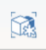

# Gruppe eindeutig machen

---

Sie können eine Gruppe von Objekten kopieren und anschließend von der Originalgruppendefinition lösen.

1. Klicken Sie im Werkzeugkasten auf das Symbol Als eindeutig definieren .
2. Klicken Sie auf eine Gruppe, um sie auszuwählen und als eindeutig zu definieren.
3. Klicken Sie auf  (Fertig stellen) in der oberen linken Ecke.

