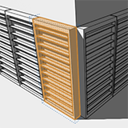

# Verschachteln von Gruppen

---

Dies sind clusterähnliche Elemente in einem Entwurf.

Gruppen können als Containerelemente behandelt werden, in denen kleinere Gruppen enthalten sind. Aus diesen verschachtelten Gruppen können Sie größere Gruppenstrukturen erstellen.

1. Wählen Sie eine vorhandene Gruppe aus.
2. Fügen Sie ihr ein oder mehrere neue Objekte hinzu.
3. Wählen Sie Objekte oder Flächen aus, die Sie einer zweiten Gruppe hinzufügen möchten.
4. Rufen Sie das Kontextmenü auf und klicken Sie auf das Symbol Gruppe.
5. Klicken Sie in der oberen linken Ecke auf (Fertig stellen). 

