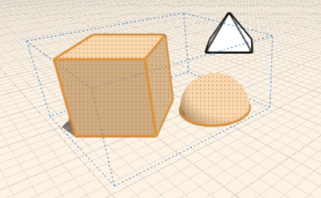

# Verwenden von Gruppen

---

Sie können ein oder mehrere Objekte zu Gruppen zusammenfassen, die sich leicht bearbeiten lassen.

Gruppen ermöglichen eine effizientere Erstellung von Geometrie.

* Nachdem Sie durch Platzieren von Grundkörpern oder Skizzieren von Formen Objekte erstellt haben, können Sie diese in Gruppen zusammenfassen, die jeweils als einzelnes wiederverwendbares Objekt behandelt werden. Durch Kopieren einer Gruppe erstellen Sie *Exemplare*. Solche Objekte sind miteinander verknüpft, d. h., Änderungen an einem Objekt bewirken die Aktualisierung auch der übrigen Objekte. Gruppen sind hilfreich beim Strukturieren von Skizzen und für die schnelle Aktualisierung ähnlicher Objekte.
* Die Werkzeuge für die Gruppierung sind über einen Werkzeugkasten problemlos zugänglich: Gruppe, Gruppierung aufheben, Als eindeutig definieren und Bearbeiten. (Diese Befehle sind auch im Kontextmenü enthalten.) Bei den Werkzeugen im Werkzeugkasten wählen Sie zuerst die Aktion und danach das Objekt, auf das diese angewendet werden soll. Beim Kontextmenü gehen Sie in umgekehrter Reihenfolge vor (was einen zusätzlichen Mausklick erforderlich macht): Sie wählen zuerst ein Objekt und dann die für dieses Objekt auszuführende Aktion. Aufgrund dieser Abfolge von Aktion und Auswahl ist der Werkzeugkasten für die Bearbeitung verschachtelter Gruppen besser geeignet. Sie können auch Tastaturbefehle verwenden: G, E, F (Gruppe, Bearbeiten, Fertig stellen) sowie U (Gruppierung aufheben) und M (Als eindeutig definieren).

 

Nur bestimmte Elemente eines Objekts können gruppiert werden: ein ganzes Objekt, eine Fläche und eine unabhängige Kante. Scheitelpunkte und zu anderen Elementen gehörige Kanten können nicht gruppiert werden.

Sie können eine Reihe von Objekten aus einem einzelnen Exemplar erstellen und mithilfe eines Kontrollkästchens die Objekte in der Reihe zu einer Gruppe zusammenfassen.

#### Themen in diesem Abschnitt

* [Gruppieren/Aufheben der Gruppierung von Objekten](../Group-Ungroup Objects.md)

Nehmen Sie Geometrie zur einfacheren Bearbeitung in Gruppen auf.

* [Gruppe bearbeiten](../Edit Group.md)

Aktualisieren oder Ändern einer vorhandenen Gruppe.

* [Gruppe eindeutig machen](../Make Group Unique.md)

Kopieren einer Gruppe von Objekten und Lösen von der ursprünglichen Gruppendefinition.

* [Verschachteln von Gruppen](../Nest Groups.md)

Zusammenfassen ähnlicher Elemente innerhalb eines Entwurfs.

* [Skalieren von Gruppen](../Scale a Group.md)

Skalieren eines Gruppenexemplars unter Beibehaltung der Beziehung zu anderen Exemplaren.

* [Anwenden von Ebenen und Materialien auf eine Gruppe ](../Apply Levels and Materials to a Group.md)

Eine Möglichkeit, zahlreiche Objekte gleichzeitig zu bearbeiten.

* [Gruppenachsen und Arbeitsebenen](../Group Axes and Work Planes.md)

