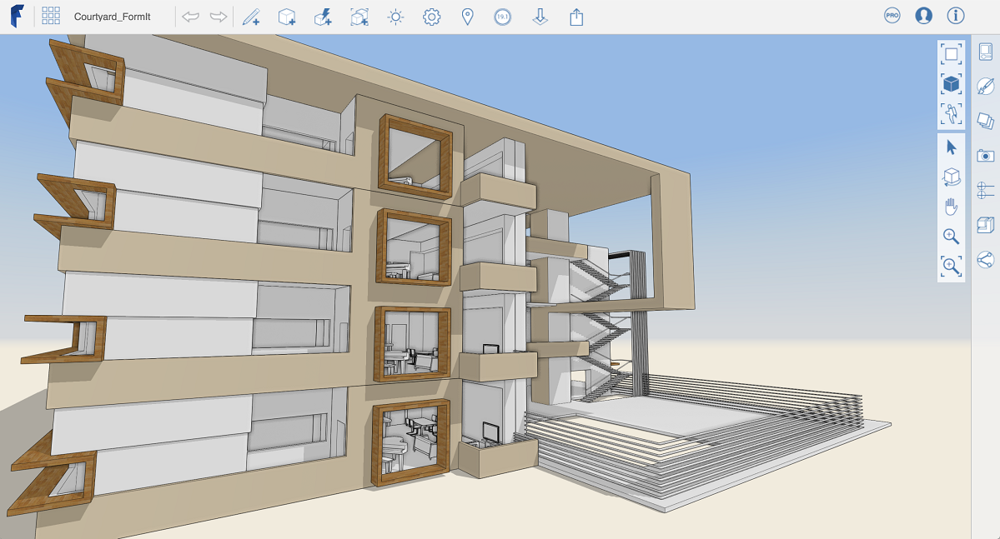

# Visualisierung des Entwurfs

---

Visualisierung des Entwurfs mit Materialien, Layern und Szenen

Mit* [Materialien](../Using Materials/README.md)* fügen Sie Ihren Entwürfen Farben und Texturen hinzu.

Mit* [Layern](../Layers.md)* steuern Sie die Sichtbarkeit einzelner Elemente.

Mit *[Szenen](../Scenes.md) *erstellen Sie gespeicherte Blickpunkte.

#### Themen in diesem Abschnitt

* [ Arbeiten mit Materialien](../Using Materials/README.md)

Mit Materialien arbeiten Sie Ihre Entwürfe detaillierter aus, verbessern sie und gestalten sie ansprechender.

* [Layer](../Layers.md)

Verwenden Sie Layer zur Steuerung der Sichtbarkeit einzelner Objekte.

* [Szenen](../Scenes.md)

Verwenden Sie Szenen, um gespeicherte Blickpunkte zu erstellen und zu ihnen zurückzunavigieren.

