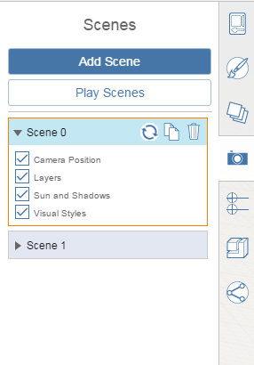

# Szenen

---

Verwenden Sie Szenen, um gespeicherte Blickpunkte zu erstellen und zu ihnen zurückzunavigieren.

## Erstellen und Ändern von Szenen

1. Klicken Sie in der Szenenpalette auf Szene hinzufügen. Die aktuelle Kameraposition, der [Layer](../Layers.md)-Status, der [Sonnenstand](../../Building Performance/Sun and Shadow Settings.md) und die [Bildstile](../../Application and Sketch Settings/Sketch Settings.md) werden in dieser Szene gespeichert.
2. Durch Doppelklicken auf den Namen können Sie die Szene umbenennen.
3. Klicken Sie auf die Schaltfläche Aktualisieren , um die Szene entsprechend dem momentan sichtbaren Blickpunkt und den Einstellungen zu aktualisieren.
4. Klicken Sie auf die Schaltfläche Duplizieren , um eine Kopie der aktuellen Szene zu erstellen.
5. Klicken Sie auf die Schaltfläche Löschen , um die aktuelle Szene zu löschen.
6. Legen Sie mithilfe der Kontrollkästchen unter den einzelnen Szenen fest, ob die Kameraposition, der [Layer](../Layers.md)-Status, der [Sonnenstand](../../Building Performance/Sun and Shadow Settings.md) oder [Bildstile](../../Application and Sketch Settings/Sketch Settings.md) auf die Szene angewendet werden sollen.

## Navigieren in Szenen

1. Klicken Sie auf eine Szene, um zu dieser zu navigieren.
2. Durch Klicken auf Szenen abspielen werden diese automatisch nacheinander wiedergegeben.
3. Durch Klicken auf Szenen anhalten beenden Sie die Präsentation.

