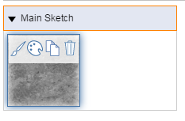

# Anwenden eines Materials

---

Verwenden Sie den Material-Editor, um ein Material einem Objekt oder einer ausgewählten Fläche eines Objekts zuzuweisen.

Sie können Materialien auf Flächen oder ganze Objekte anwenden.

## Anwenden eines Materials

1. Klicken Sie auf die Registerkarte an der rechten Seite des Bildschirms und dann auf das Symbol für den Material-Editor.
2. Bewegen Sie den Mauszeiger über das Material, das Sie anwenden möchten.

3. Wählen Sie das Pinselsymbol.
4. Um das Material auf eine einzelne Fläche anzuwenden, klicken Sie auf diese. Um das Material auf das gesamte Objekt anzuwenden, doppelklicken Sie darauf.
## Material auf eine Gruppe anwenden

Materialien, die auf nicht zu Gruppen gehörige Objekte in der Skizze angewendet werden, werden unter der Überschrift Hauptskizze angezeigt. Zum Anwenden von Materialien auf Flächen und/oder Objekte in einer Gruppe stehen zwei Optionen zur Verfügung:

1. *Gruppenexemplar*: Wenn Sie ein Material auf eine ganze Gruppe, nicht jedoch auf andere Exemplare dieser Gruppe anwenden möchten, können Sie die Gruppe wie oben beschrieben mit dem Material versehen.
2. *Gruppendefinition*: Wenn das Material auf sämtliche Exemplare der Gruppe angewendet werden soll, müssen Sie zuerst [die Gruppe bearbeiten](../../../Using Groups/Edit Group.md) und danach die oben angegebenen Schritte ausführen. Das Material wird dann unter der Überschrift mit dem Namen der Gruppe angezeigt.

